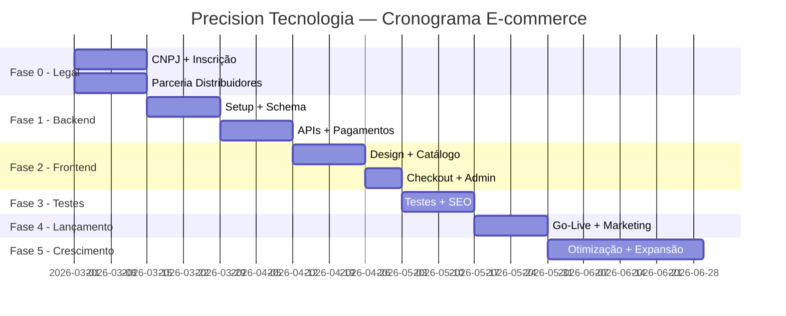
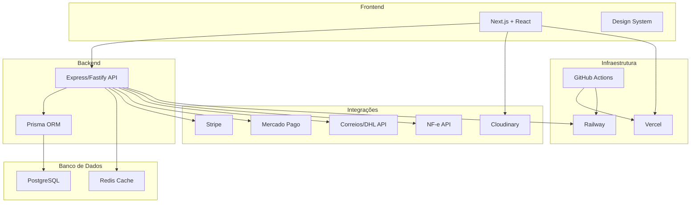

# 🖧 Precision Tecnologia — Plano Completo do E-commerce

> **Empresa:** Precision Tecnologia  
> **Segmento:** Venda de produtos Huawei Enterprise + infraestrutura de rede  
> **Modelo:** E-commerce custom (Node.js) • Pronta entrega + Sob encomenda  
> **Mercado:** Brasil (principal) + vendas internacionais  
> **Público-alvo:** Integradores de TI, ISPs, empresas diretas  
> **Data:** Fevereiro 2026

---

## 1. Catálogo de Produtos

### 🔌 Switches de Rede

| Linha | Modelos | Aplicação |
|---|---|---|
| **Campus Switches** | CloudEngine S16700, S12700E, S8700, S5735-L-V2 | Redes corporativas, governo, educação, finanças |
| **Data Center Switches** | CloudEngine 16800, 9800, 8800, 6800 | Alto desempenho, baixa latência |
| **Série S (Legado)** | S1700, S2700, S3700, S5700, S6700, S7700, S9700 | Uso geral |
| **eKit (PME)** | Série eKit | Pequenas e médias empresas |

### 📡 Roteadores Enterprise

| Linha | Modelos | Aplicação |
|---|---|---|
| **NetEngine AR** | AR8700, AR8000, AR6700, AR6300, AR6200, AR6100 | SD-WAN, conectividade de filiais |
| **Compactos** | AR5710, AR650, AR630, AR610 | Escritórios remotos |
| **Virtuais** | AR6700V, AR1000V | Cloud-native gateway |
| **IoT Edge** | AR502H | Gateways IoT, computação de borda |

### 📶 Access Points (Wi-Fi 6 / Wi-Fi 7)

| Série | Modelos | Destaque |
|---|---|---|
| **AirEngine 8700** | 8771-X1T, 8760-X1-PRO, 8761-X1 | Wi-Fi 7, ultra-alto desempenho |
| **AirEngine 6700** | 6776-58TI, 6776-57T, 6760-X1 | Wi-Fi 6/7, alta concorrência |
| **AirEngine 5700** | 5776-26, 5773-25HW, 5773-22P | Wi-Fi 6, custo-benefício |

### 🔗 GBICs / Módulos Ópticos (SFP/SFP+/QSFP)

| Tipo | Velocidade | Distância | Fibra |
|---|---|---|---|
| **SFP (mini-GBIC)** | 1 Gbps | 300m - 120km | MMF 850nm / SMF 1310nm/1550nm |
| **SFP+** | 10 Gbps | 300m - 80km | MMF / SMF |
| **SFP28** | 25 Gbps | Até 10km | SMF |
| **QSFP+** | 40 Gbps | Data center | MMF / SMF |
| **QSFP28** | 100 Gbps | Data center | SMF |
| **QSFP-DD** | 400 Gbps | Data center | SMF |

- Conectores: LC (duplex/simplex), RJ-45 (cobre)
- Suporte DDM/DOM para monitoramento em tempo real
- Compatíveis com equipamentos Huawei e multi-vendor (MSA)

### 🔌 Patch Cords

| Tipo | Categorias | Detalhes |
|---|---|---|
| **UTP** | Cat5e, Cat6, Cat6a | Conector RJ-45, diversas metragens |
| **Fibra Óptica** | SM / MM | Conectores LC-LC, SC-SC, LC-SC |
| **Blindado (STP)** | Cat6a | Para ambientes com interferência |

### 📋 Patch Panels

| Tipo | Portas | Detalhes |
|---|---|---|
| **UTP** | 24/48 portas | Cat5e, Cat6, Cat6a — rack 19" |
| **Fibra Óptica** | 12/24/48 portas | DIO — adaptadores LC, SC |
| **Descarregado** | Variável | Modular, aceita keystone |

### 🔧 Conectores

| Tipo | Aplicação |
|---|---|
| **RJ-45** | Cat5e, Cat6, Cat6a — macho/fêmea |
| **Keystone** | Tomadas e patch panels modulares |
| **LC / SC** | Fibra óptica — monomodo/multimodo |
| **Fast Connect (Huawei)** | Conectorização rápida FTTH/FTTX |
| **Splice** | Fusão de fibra óptica |

### 🛡️ Firewalls (Segurança)

| Série | Modelos | Aplicação |
|---|---|---|
| **HiSecEngine USG** | USG6500E, USG6600F, USG6700E, USG12000 | PMEs, data centers, IA |

### 💾 Storage

| Linha | Destaque |
|---|---|
| **OceanStor Dorado** | All-Flash, alta performance |
| **OceanStor Data Lake** | AI data lake, proteção de dados |

### ⚡ Energia

| Linha | Modelos | Aplicação |
|---|---|---|
| **UPS** | UPS 5000A (30-60kVA), UPS2000-H, UPS5000-E | Infraestrutura crítica |
| **FusionSolar** | Inversores string | Residencial, comercial, utility |

---

## 2. Modelo de Negócio

### Parceria Huawei

| Nível | Compra | Requisitos |
|---|---|---|
| Diamond | Direto da Huawei | Volume alto, certificações avançadas |
| Gold | Via distribuidores | Certificações intermediárias |
| Silver | Via distribuidores | Certificações básicas |
| Autorizado | Via distribuidores | Requisitos mínimos |

### Distribuidores no Brasil

| Distribuidor | Foco |
|---|---|
| **SND Distribuição** | Cloud, Datacenter, Conectividade |
| **WDC Networks** | ISPs, operadoras, FusionSolar |
| **Dicomp** | Provedores, segurança, telefonia |
| **Mazer** | Nobreaks, baterias, micro DC |
| **Connectoway** | eKit, PMEs |

### Modalidades de Venda

| Modo | Descrição |
|---|---|
| **Pronta Entrega** | Estoque local, envio imediato — produtos de alta rotação |
| **Sob Encomenda** | Pedido ao distribuidor, prazo 5-15 dias — produtos especializados |

---

## 3. Legislação e-commerce Brasil

| Lei | Exigência |
|---|---|
| **CDC** (8.078/1990) | Direitos do consumidor, arrependimento 7 dias |
| **Decreto 7.962/2013** | CNPJ visível, preços claros, atendimento |
| **LGPD** (13.709/2018) | Proteção de dados, política de privacidade |
| **ANATEL** | Homologação de equipamentos de telecomunicações |

### Requisitos Legais
- CNPJ (ME ou LTDA) — CNAE: 4751-2/01
- Inscrição Estadual + NF-e
- Certificado Digital e-CNPJ
- Conta PJ

### Reforma Tributária (2026+)
- 2026: Alíquotas-teste CBS (0,9%) + IBS (0,1%)
- 2027: CBS cheia + split payment
- 2033: Extinção ICMS/ISS

---

## 4. Formas de Pagamento

### Nacional

| Método | Uso | Nota |
|---|---|---|
| **PIX** | ~44% | Ideal tickets altos, instantâneo |
| **Cartão Crédito** | ~40% | Parcelamento 12x — essencial |
| **Boleto** | ~4% | Compradores corporativos |
| **Faturamento B2B** | B2B | Boleto 30/60/90 dias |

### Internacional

| Gateway | Destaque |
|---|---|
| **Stripe** | 195 países, 135+ moedas |
| **PayPal** | Confiança global |
| **PagSeguro** | 140+ métodos LATAM |

---

## 5. Vendas Internacionais

| Aspecto | Detalhe |
|---|---|
| Transportadoras | DHL, FedEx, UPS |
| Correios | Exporta Fácil |
| Documentação | DU-E obrigatória |
| Regulamentação | Verificar FCC (EUA), CE (Europa) |
| Canais | Loja própria, Amazon Business |

---

## 6. Stack Técnica — E-commerce Custom

| Componente | Tecnologia |
|---|---|
| **Runtime** | Node.js |
| **Framework Backend** | Express.js ou Fastify |
| **Framework Frontend** | Next.js (React) + TypeScript |
| **Banco de Dados** | PostgreSQL + Prisma ORM |
| **Cache** | Redis |
| **Pagamentos** | Stripe SDK + Mercado Pago API |
| **Autenticação** | NextAuth.js (clientes) + JWT (API B2B) |
| **Busca** | Algolia ou Meilisearch |
| **Upload/Imagens** | Cloudinary ou AWS S3 |
| **Email** | Resend ou SendGrid |
| **NF-e** | Nota Carioca / Nuvem Fiscal API |
| **Hospedagem** | Vercel (frontend) + Railway/Render (backend) |
| **CI/CD** | GitHub Actions |
| **Analytics** | Google Analytics 4 + Hotjar |
| **Monitoramento** | Sentry |

### Funcionalidades Específicas B2B
- Tabela de preços diferenciada por cliente/nível
- Cotação personalizada (solicitar orçamento)
- Login de integradores com condições especiais
- Faturamento com prazo (30/60/90 dias)
- Download de datasheets e fichas técnicas
- Filtros avançados (velocidade, tipo fibra, distância, categoria)
- Comparador de produtos
- Rastreamento de pedidos
- API para integradores (B2B)

---

## 7. Plano de Implementação — 5 Fases

### Fase 0 — Legal & Comercial (Semanas 1-2)
- [ ] CNPJ + Inscrição Estadual
- [ ] Certificado Digital e-CNPJ
- [ ] Registro marca "Precision Tecnologia" (INPI)
- [ ] Formalizar parceria com distribuidores Huawei
- [ ] Conta PJ + gateway de pagamento
- [ ] Verificar homologação ANATEL

### Fase 1 — Desenvolvimento Backend (Semanas 3-6)
- [ ] Setup repositório Git + CI/CD
- [ ] Iniciar projeto Next.js + Express/Fastify
- [ ] Schema do banco (PostgreSQL + Prisma):
  - Produtos, categorias, variantes, estoque
  - Clientes (B2C + B2B com níveis)
  - Pedidos, pagamentos, frete
  - Tabelas de preço por nível
- [ ] API de produtos (CRUD, filtros, busca)
- [ ] API de autenticação (login, registro, B2B)
- [ ] Integração Stripe (PIX, cartão, parcelamento)
- [ ] Integração Mercado Pago
- [ ] Integração frete (Correios + transportadoras)
- [ ] Sistema de NF-e

### Fase 2 — Frontend & UI (Semanas 7-9)
- [ ] Design system (identidade visual tech/profissional)
- [ ] Home page com categorias em destaque
- [ ] Catálogo com filtros avançados:
  - Por categoria (switches, APs, GBICs, patch cords...)
  - Por velocidade (1G, 10G, 25G, 40G, 100G)
  - Por tipo de fibra (monomodo, multimodo, cobre)
  - Por disponibilidade (pronta entrega / sob encomenda)
- [ ] Página de produto com specs, datasheets, fotos
- [ ] Comparador de produtos
- [ ] Carrinho + checkout (com opção cotação B2B)
- [ ] Área do cliente (pedidos, rastreamento)
- [ ] Painel admin (gestão de produtos, pedidos, estoque)
- [ ] Responsivo mobile

### Fase 3 — Integrações & Testes (Semanas 10-11)
- [ ] Testes de checkout (PIX, cartão, boleto)
- [ ] Testes de frete nacional
- [ ] Frete internacional (DHL/FedEx)
- [ ] SEO técnico (meta tags, schema.org Product)
- [ ] Performance (Core Web Vitals)
- [ ] Segurança (LGPD compliance, SSL, sanitização)

### Fase 4 — Lançamento & Marketing (Semanas 12-13)
- [ ] Cadastro do catálogo inicial
- [ ] Google Ads ("switch huawei preço", "access point huawei")
- [ ] LinkedIn (público B2B, decisores TI)
- [ ] Google Shopping
- [ ] Blog técnico (comparativos, tutoriais)
- [ ] WhatsApp Business + chat online
- [ ] Email marketing para base de clientes

### Fase 5 — Pós Go-Live (Semanas 14+)
- [ ] Monitoramento de conversão
- [ ] Expansão para marketplaces (Mercado Livre, Amazon BR)
- [ ] Programa de parceiros/integradores
- [ ] Multi-idioma (PT-BR + EN) para vendas internacionais
- [ ] Dashboard analytics
- [ ] Checkout multi-moeda (BRL + USD)

---

## 8. Estimativa de Custos

| Item | Custo Estimado |
|---|---|
| Abertura empresa + contador | R$ 1.000 - R$ 3.000 |
| Hospedagem (Vercel + Railway) | R$ 200 - R$ 500/mês |
| Domínio (.com.br + .com) | R$ 100 - R$ 150/ano |
| Desenvolvimento custom | R$ 15.000 - R$ 50.000 |
| Estoque inicial | R$ 30.000 - R$ 150.000 |
| Marketing (3 meses iniciais) | R$ 5.000 - R$ 20.000 |
| Ferramentas (Stripe, Algolia, Sentry) | R$ 300 - R$ 800/mês |
| **Total estimado (investimento inicial)** | **R$ 52.000 - R$ 225.000** |

---

## 9. Cronograma Visual

---

## 10. Arquitetura do Sistema

